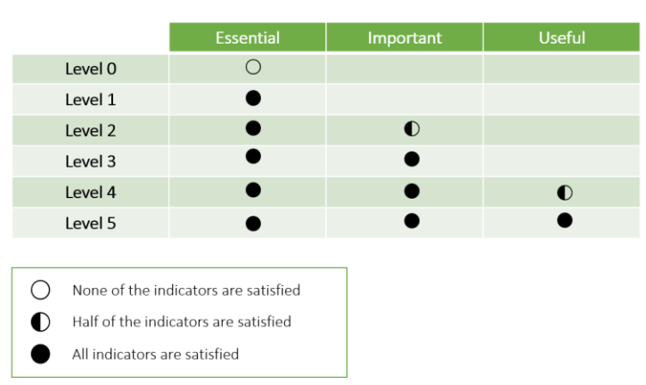
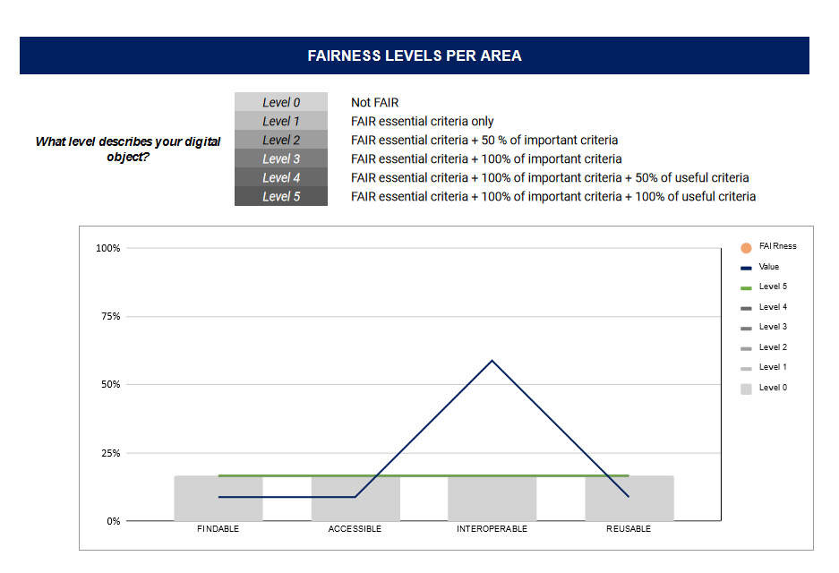
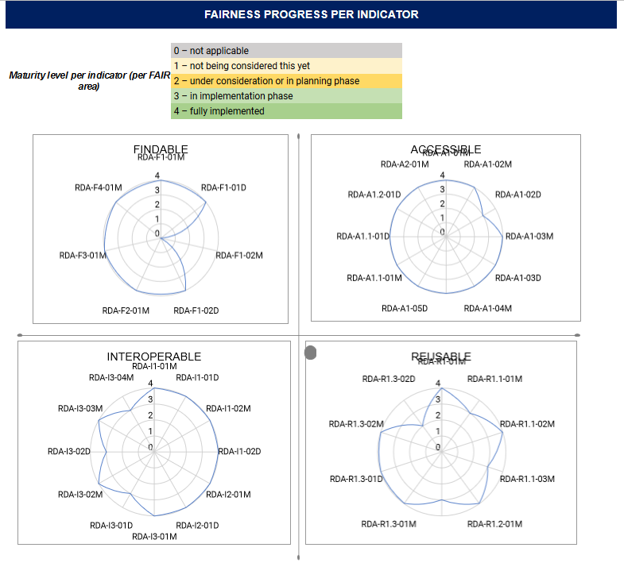

  
# Evaluation Methods
The FAIRplus maturity model is still under development. :construction:

Currently RDA Evaluation methods will be tested and used for defining the levels of data set maturity.

As the FAIRplus process maturity model develops, a new data maturity evaluation approach will be introduced.

 

The RDA Data Maturity model suggests two different evaluation methods:

-   [**Measuring Progress**](#measuring-progress): in this perspective, the emphasis lies on delivering a measure of the extent to which a resource under evaluation meets the requirements expressed in an indicator, giving an indication of which steps may be taken to achieve full satisfaction of an indicator.
    
-   [**Measuring Pass-or-Fail**](#measuring-pass-or-fail): in this perspective, the emphasis lies on determining whether a resource under evaluation meets the requirement of an indicator on a binary, pass-or-fail scale, providing a measure of how a resource under evaluation performs in reaching a particular target level of FAIRness.
  
### Measuring Progress
- Focus on the extent to which a resource under evaluation meets the requirement of the indicator, in order to answer the question:
	>“How can the FAIRnessof this data be improved?”

The indicator maturity levels are defined as follows:

     0 – not applicable
     1 – not being considered yet
     2 – under consideration or in planning phase
     3 – in implementation phase
     4 – fully implemented

### Measuring Pass-or-Fail
- Focus on determining how a resource under evaluation performs on meeting the indicators across the FAIR areas.
- Also measures the FAIRness per area. 
	- It is measured per indicator and aggregated per FAIR area. The level per area is determined based on the compliance to priorities. This is used to provide a **measure of FAIRness**.

### Visualization of Maturity Levels

RDA suggest two different visualization methods:

1.

2. 

FAIRplus maturity levels for data usage areas together with RDA dimensions can be visualized as radar charts. 
