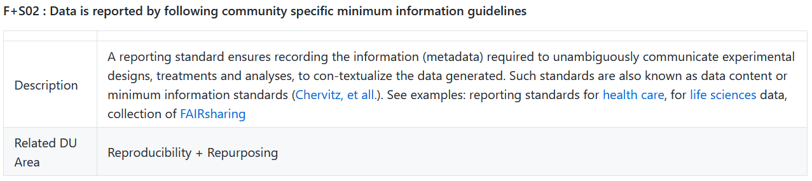
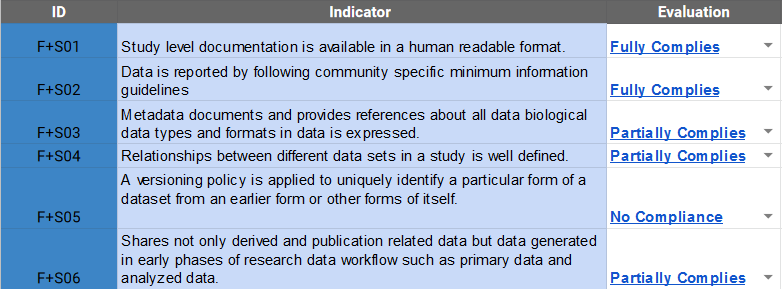
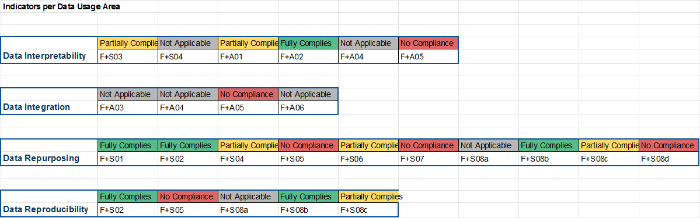

# Evaluation Method

The FAIRplus maturity model is still under development. :construction:

We are investigating existing evaluation methods, such as RDA Data Maturity Model.

FAIRplus project targets developing a maturity model based on Data Usage areas.

Current FAIRplus indicators measure compliance of data sets to given Data Usage areas, but do not provide a maturation path yet.

## How to use FAIRplus Indicators:
1) Download Evaluation form <a href="https://github.com/FAIRplus/CMM/raw/master/docs/Data%20FAIRness%20Assessment.xlsx">here</a>.

2) Read the Indicator's detail description and examples of FAIRplus indicators from Github

3) Perform manual evaluation for each metric and provide the compliance level

4) Create the Level of Compliance Visualization for each data usage area in the Excel

5) Decide the Data Usage areas that needs focus in your FAIRification and list the corresponding Indicators to improve.

Currently RDA Evaluation methods will be tested and used for defining the levels of data set maturity.
As the FAIRplus process maturity model develops, a new data maturity evaluation approach will be introduced.
 

Further:  [RDA Evaluation Model](rda_evaluation.md).
